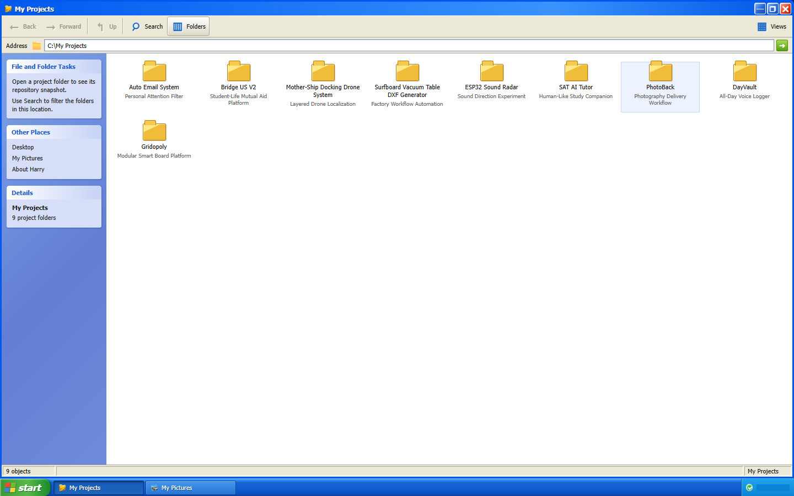
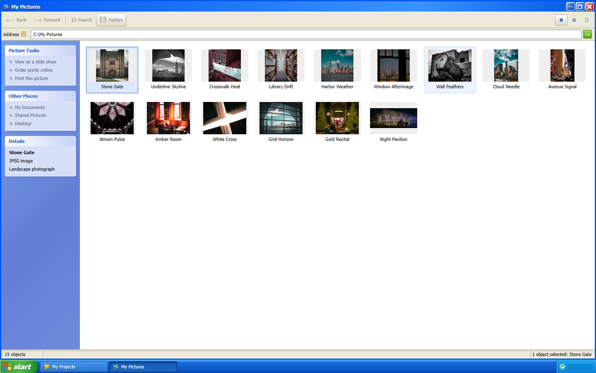
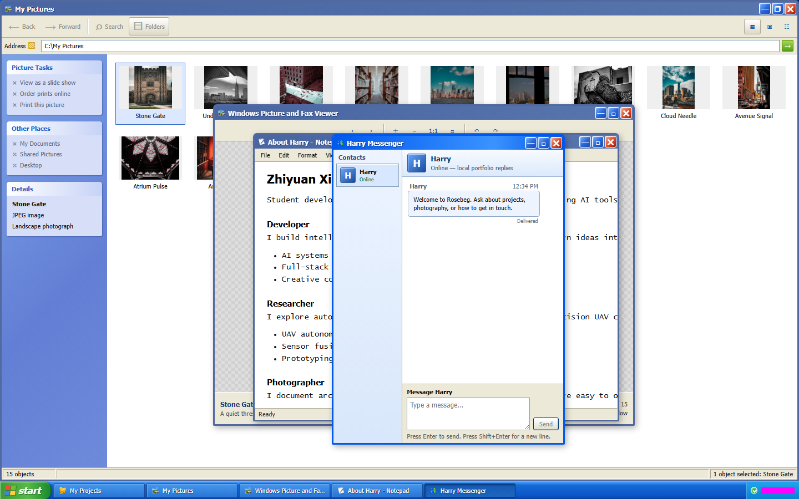

<h1 align="center">Rosebeg XP</h1>

<p align="center">
  A self-contained Windows XP desktop portfolio for exploring HarryX's software, electronics, photography, and profile.
</p>

<p align="center">
  <a href="#features">Features</a> &middot;
  <a href="#controls">Controls</a> &middot;
  <a href="#development">Development</a> &middot;
  <a href="#status">Status</a>
</p>

<p align="center">
  
</p>

Rosebeg XP turns a personal portfolio into a working browser desktop instead of a conventional scrolling page. Sign in as Harry, open independent windows, browse project folders and photographs, read the About document, or talk naturally with Harry's AI-powered digital mirror.

## Features

- **Complete XP-style session:** boot, login, Start menu, taskbar, log off, restart, shutdown, and power-on flows.
- **Real window behavior:** focus stacking, independent instances, dragging, resizing, minimizing, maximizing, restoring, and closing.
- **Project Explorer:** nine software, robotics, creative-tool, and electronics projects with local folder views and source or demo shortcuts where configured.
- **Photo workflow:** a 15-image Explorer gallery plus independent Picture and Fax Viewer windows with fit-relative zoom, centered scaling, rotation, and previous/next controls.
- **About Notepad:** Markdown-rendered, read-only profile content with working selection, copy, and Word Wrap controls.
- **Harry Messenger:** a server-side GPT-5.6 digital mirror that speaks as Harry in first person, with natural multilingual replies and current-window conversation context.
- **Responsive and accessible:** desktop, standard, and mobile layouts; semantic controls; keyboard navigation; reduced-motion support; and isolated application error states.

## Gallery

<table>
  <tr>
    <td colspan="2" align="center">
      
      <br />
      <strong>My Projects.</strong> Nine portfolio entries presented as an XP Explorer directory.
    </td>
  </tr>
  <tr>
    <td width="50%"></td>
    <td width="50%"></td>
  </tr>
  <tr>
    <td><strong>My Pictures.</strong> All 15 photographs remain visible in one browser.</td>
    <td><strong>Harry Messenger.</strong> The XP chat client talks to a server-side AI endpoint without exposing provider credentials.</td>
  </tr>
</table>

## Controls

| Input | How to use the desktop |
| --- | --- |
| Pointer | Double-click a desktop icon to open it. Drag title bars, resize from window edges or corners, and use the title-bar or taskbar controls. |
| Touch | Tap a desktop icon once. Tap the regular controls; title bars and resize regions use pointer events for touch dragging. |
| Keyboard | Use `Tab` / `Shift+Tab` to move focus and `Enter` to activate controls or desktop icons. `Escape` dismisses Start, power dialogs, and Notepad menus. In the photo viewer, use `ArrowLeft` / `ArrowRight`; in Messenger, use `Enter` to send and `Shift+Enter` for a new line. |

## Technology

| Layer | Technology | Role |
| --- | --- | --- |
| Interface | React 19 | Desktop shell, applications, system phases, and window composition |
| Language and build | TypeScript 7 + Vite 7 | Static checking, development server, and production bundle |
| Content | React Markdown + typed local records | About document, projects, photos, contacts, and AI grounding context |
| Styling | Repository-local CSS and assets | XP visual system without runtime image hotlinks |
| Production host | Node.js + Nginx + OpenAI Responses API | SPA/static delivery, security headers, health checks, rate-limited AI chat, and server-only credentials |
| Verification | Vitest, Testing Library, jsdom, and Playwright | Unit, component, functional browser, and visual regression coverage |

Messenger posts the current window's conversation to `/api/chat`, where the Node host validates and bounds the transcript before calling the OpenAI Responses API with `gpt-5.6-sol`. Responses API application-state storage is disabled, although OpenAI's applicable abuse-monitoring retention policy may still apply. The API key, private profile, safety salt, and base prompt remain server-side; provider keys must never use a `VITE_` prefix, which would expose them to the browser bundle. If no key is configured, the endpoint returns `AI_NOT_CONFIGURED` without attempting a provider request.

The digital mirror's version-controlled public knowledge and behavior specification lives in [`server/ai/harry-system-prompt.md`](server/ai/harry-system-prompt.md). Server-only biographical additions are appended through a private overlay outside the release and web roots, following [`server/ai/README.md`](server/ai/README.md).

## Content provenance

Personal copy and the 15-photo catalog were migrated from Harry's V1 portfolio source into this repository. Rosebeg XP serves its own content and assets and has no runtime dependency on V1 or its host.

[harry.rosebeg.com](https://harry.rosebeg.com/) serves the current Rosebeg XP V2 deployment.

## Development

Prerequisites: Node.js `^20.19.0` or `>=22.12.0` and npm. Browser tests also require Playwright's Chromium build.

```powershell
npm ci
npm exec -- playwright install chromium
npm run dev
```

Open `http://127.0.0.1:5173`. The development server binds only to the local loopback interface.

For the production-style Node host:

```powershell
npm run build
$env:HOST = "127.0.0.1"
$env:PORT = "3000"
$env:OPENAI_API_KEY = "<server-only key>"
$env:OPENAI_MODEL = "gpt-5.6-sol"
npm start
```

The Node process serves `dist/`, exposes `/api/health` and `/api/chat`, applies security headers, and falls back to `index.html` for client routes. `HARRY_PRIVATE_PROFILE_PATH` and `CHAT_SAFETY_SALT` are optional server-only settings. In production, Nginx terminates HTTPS and proxies to this loopback-only process.

### Test matrix

| Check | Command |
| --- | --- |
| Unit and component tests | `npm test` |
| Type check | `npm run check` |
| Production build | `npm run build` |
| Functional end-to-end tests | `npm run test:e2e` |
| Visual regression tests | `npm run test:visual` |

The committed visual baselines target Chromium on Windows at desktop, standard, and mobile viewport sizes. In PowerShell environments where the `npm.ps1` shim is disabled, use `npm.cmd` in place of `npm`.

## Repository structure

```text
src/
  system/       Boot, login, shutdown, and restart state
  desktop/      Desktop icons, Start menu, taskbar, and app registry
  windowing/    Window state, bounds, frames, and pointer interactions
  apps/         Projects, photos, About Notepad, and Messenger
  content/      Typed portfolio data, Markdown, contacts, and chat copy
  shared/       XP controls, dialogs, themes, and error boundaries
public/assets/  Local icons, photography, and wallpaper
server/         Production Node host and native Node tests
tests/e2e/      Functional flows and committed visual baselines
docs/screenshots/  README screenshots copied from verified baselines
```

## Status

Rosebeg XP V2 is deployed at [harry.rosebeg.com](https://harry.rosebeg.com/) as a BaoTa-managed Node project behind Nginx and HTTPS. Harry Messenger uses a rate-limited server-side OpenAI integration so provider credentials and private profile context never enter the browser bundle.

## Contact

- [GitHub — @Ha22yX](https://github.com/Ha22yX)
- [Instagram — @ha22yx](https://www.instagram.com/ha22yx/)
- [Email — ha22y.xing@gmail.com](mailto:ha22y.xing@gmail.com)
- WeChat — `imxzy945`
